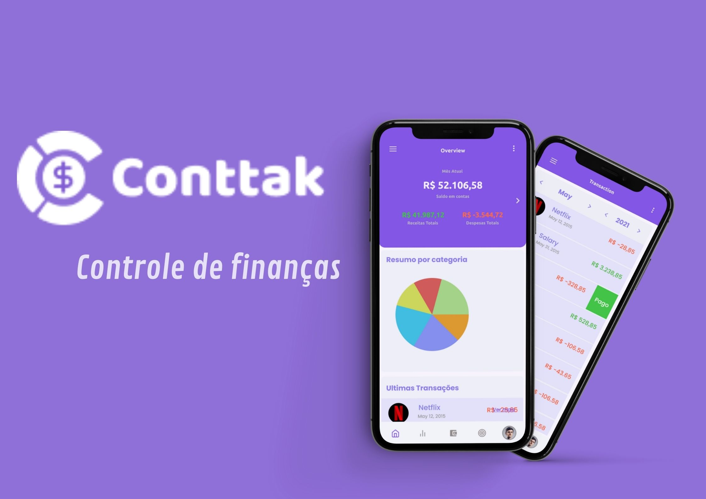

<p align="center">
  <br>
</p>

# *CONTTAK APP*
_Um aplicativo de gestão financeira pessoal_


## Projeto
Este projeto visa auxiliar pessoas a ter o controle sobre suas finanças, ampliando a sua visão dos seus gastos.

## Instalação

Caso queira ver este projeto em funcionamento, [clique aqui](https://expo.dev/client) e baixe o aplicativo da Expo no seu smartphone.

Em seguida, abra o app e escaneie o QR Code [neste link](https://expo.dev/@ludriano/conttak). 

Use estas credenciais para ter acesso ao aplicativo.
`Login: ludriano.washi@gmail.com` e
`Senha: 1234`
## Funcionamento

No momento este projeto está totalmente **estático** e, portanto, possui somente efeitos visuai. 

## Configuração 


## Históricos de lançamentos

  - 0.0.1
    - Trabalho em andamento

## Autor

##### Ludriano Washington 
  - **Email:** ludinho.washi@gmail.com
  - **Linkedin:** linkedin.com/in/ludrianowashington
  - **Instagram:** instagram.com/ludrianowashington

## Ferramentas utilizadas

  * [React Native]()
  * [Typescript]()
  * [Javascript]()
  * [Expo]()
  <!-- E, mais recente, inseri a versão com...

  * [ReactJs]() -->
  
## Licença

Distribuído sob a licença *__MIT__*. Saiba mais em [LICENSE.md](LICENSE.md)


## Contribuição

Caso queira contribuir, siga os seguintes passos:
  
  1. Faça o *__fork__* do projeto [aqui](http://github.com/ludrianowashington/conttakapp/fork)
  2. Crie uma **_branch_** para poder modificar (```git checkout -b feature/foo```)
  3. Faça o **_commit_** (```git commit -am 'Add new Commit```)
  4. Faça o __*push*__(```git push origin feature/foo```)  
  5. Crie um novo **_Pull Request_**.

---
Feito com &#x1f493; por [Ludriano Washington](http://github.com/ludrianowashington)
